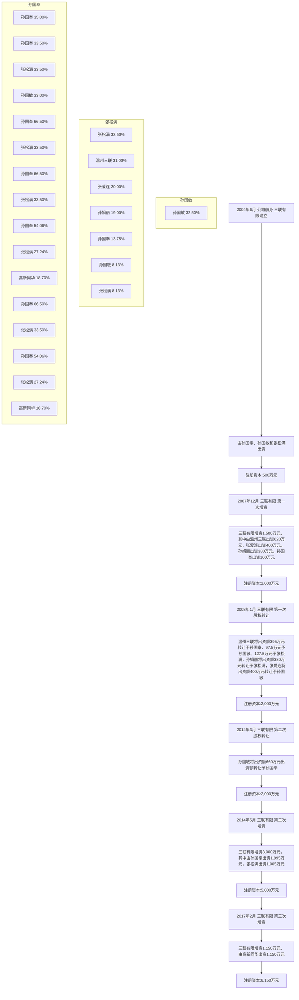
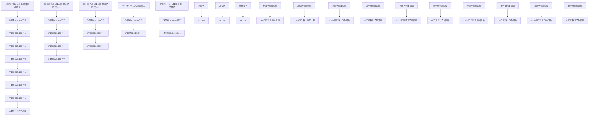

# 三联锻造 - 融资历史候选文本

提取时间: 2026-06-05T11:44:08.889570

## 1. 融资租入固定资产的认定依据、计价方法和折旧方法（适用 2020 年度）

原文长度: 262 字符

```
# 融资租入固定资产的认定依据、计价方法和折旧方法（适用 2020 年度）

本公司在租入的固定资产实质上转移了与资产有关的全部风险和报酬时确认该项固定资产的租赁为融资租赁。融资租赁取得的固定资产的成本，按租赁开始日租赁资产公允价值与最低租赁付款额现值两者中较低者确定。融资租入的固定资产采用与自有固定资产相一致的折旧政策计提租赁资产折旧。能够合理确定租赁期届满时将会取得租赁资产所有权的，在租赁资产使用年限内计提折旧；无法合理确定租赁期届满时能够取得租赁资产所有权的，在租赁期与租赁资产使用寿命两者中较短的期间内计提折旧。
```

---

## 2. （4）应收款项融资

原文长度: 1,124 字符

```
# （4）应收款项融资

①报告期各期末，公司应收款项融资情况如下：

单位：万元

<table><tr><td>项目</td><td>2022年12月31日公允价值</td><td>2021年12月31日公允价值</td><td>2020年12月31日公允价值</td></tr><tr><td>银行承兑汇票</td><td>4,629.03</td><td>4,014.17</td><td>1,625.56</td></tr><tr><td>合计</td><td>4,629.03</td><td>4,014.17</td><td>1,625.56</td></tr></table>

报告期各期末，公司应收款项融资公允价值分别为 1,625.56 万元、4,014.17万元和 4,629.03 万元，均为银行承兑汇票。随着 2021 年度公司营业规模的快速增长，2021年末应收款项融资余额较上年末增长较多。

②报告期各期，公司应收款项融资增减变动情况如下：

单位：万元

<table><tr><td>项目</td><td>2022年度</td><td>2021年度</td><td>2020年度</td></tr><tr><td>一、期初应收款项融资</td><td>4,014.17</td><td>1,625.56</td><td>2,454.79</td></tr><tr><td>二、本期增加</td><td>45,332.49</td><td>33,362.83</td><td>19,209.51</td></tr><tr><td>三、本期减少</td><td>44,717.63</td><td>30,974.22</td><td>20,038.74</td></tr><tr><td>其中:到期兑付</td><td>5,331.93</td><td>4,611.06</td><td>2,098.91</td></tr><tr><td>背书转让</td><td>19,668.50</td><td>15,816.72</td><td>7,501.69</td></tr><tr><td>贴现</td><td>19,717.21</td><td>10,546.44</td><td>10,438.14</td></tr><tr><td>四、期末应收款项融资</td><td>4,629.03</td><td>4,014.17</td><td>1,625.56</td></tr></table>

报告期各期，公司确认的应收款项融资主要用于到期兑付、背书转让或贴现，不存在因票据到期无法承兑而转为应收账款的情形。
```

---

## 3. ①历史沿革

原文长度: 1,827 字符

```
# ①历史沿革

重庆硕联设立时股东为夏品、张银宽、杨甫伦。2016年11月，股东杨甫伦退出；2017 年 6 月，新增股东张孙杰；2018 年 8 月，股东张孙杰、夏品退出，新增股东孙凤娟。

重庆硕联历史沿革情况如下：

<table><tr><td>序号</td><td>时间</td><td>事项</td><td>注册资本(万元)</td><td>股东构成及出资比例</td></tr><tr><td>1</td><td>2016年5月</td><td>设立</td><td>100</td><td>张银宽 40%、夏品 30%、杨甫伦 30%</td></tr><tr><td>2</td><td>2016年11月</td><td>股东变更</td><td>100</td><td>张银宽 80%、夏品 20%</td></tr><tr><td>3</td><td>2017年6月</td><td>股东变更</td><td>100</td><td>张银宽 40%、夏品 20%、张孙杰 40%</td></tr><tr><td>4</td><td>2018年8月</td><td>股东变更</td><td>100</td><td>孙凤娟 60%、张银宽 40%</td></tr></table>

截至本招股说明书签署日，公司实际控制人孙国奉、张一衡、孙国敏、孙仁豪不存在直接或间接持有重庆硕联权益的情况。公司及实际控制人均未持有过重庆硕联的股权，双方在历史沿革方面相互独立。

②主营业务及主要客户、供应商

重庆硕联主营业务为摩托车配件生产、销售。因重庆地区厂房租金、人员成本较高，已于2018年 10月停止生产。

重庆硕联经营期间，客户主要集中在重庆地区，主要客户为重庆昌明摩托车股份有限公司、重庆全悦祥精密锻造机械工业有限公司、重庆全悦车业发展有限公司等；主要供应商为重庆艺炉金属热处理有限责任公司、重庆予广模具材料有限公司等。报告期内，公司与重庆硕联销售渠道、主要客户及供应商不存在重叠情况。

③报告期内与公司的交易和往来

报告期内，重庆硕联与公司不存在交易和往来。

④公司与重庆硕联在资产、人员、业务、技术、财务方面相互独立

公司与重庆硕联在资产、人员、业务、技术、财务方面相互独立的具体情况如下：

<table><tr><td>序号</td><td>项目</td><td>具体情况分析</td></tr><tr><td>1</td><td>资产</td><td>重庆硕联经营期间,其主要资产为用于摩托车配件生产的机器设备,公司与重庆硕联相互独立,不存在固定资产、无形资产等资产共用、混同的情况。公司与重庆硕联不存在使用对方商标商号的情形。公司与重庆硕联在资产方面相互独立。</td></tr><tr><td>2</td><td>人员</td><td>重庆硕联人员为从事摩托车配件生产、销售、管理的相关人员,人员由其独立招聘,自其设立以来与公司不存在人员重叠情况。</td></tr><tr><td>3</td><td>业务</td><td>重庆硕联主营业务为摩托车配件生产、销售,与公司主营业务不属于同一细分行业领域。公司与重庆硕联在业务方面互相独立。</td></tr><tr><td>4</td><td>技术</td><td>重庆硕联主要技术为摩托车配件生产相关技术,重庆硕联经营期间,公司和重庆硕联相互独立,不存在共同开发、共同享有技术成果的情况,不存在技术共用、混同的情形。</td></tr><tr><td>5</td><td>财务</td><td>公司设置了独立的财务部门,配备了相关财务人员,建立了独立的财务核算系统,独立做出财务决策,具有规范的财务会计制度和财务管理制度,并在银行开立了独立财务账户、独立核算、独立纳税,与重庆硕联不存在财务机构、人员混同的情况。</td></tr></table>

重庆硕联主营业务为摩托车配件生产、销售，与公司主营业务不属于同一细分行业领域。报告期内，公司与重庆硕联相互独立，不存在人员相互兼任对方职务等人员交叉的情况；不存在固定资产、无形资产等资产共用、混同的情况；主要客户、供应商不存在重合的情况。

⑤公司未来无收购重庆硕联的安排

公司与重庆硕联不存在同业竞争关系，不存在从事相同或相似业务的情形。重庆硕联目前已无生产经营。公司未来无收购重庆硕联的安排。
```

---

## 4. ①历史沿革

原文长度: 445 字符

```
# ①历史沿革

山远锻压设立时股东为谢荣雨、张旦。2020 年 4 月，张银宽受让谢荣雨、张旦合计持有的山远锻压 100%股权。截至本招股说明书签署日尚未办理股权变更手续。

山远锻压历史沿革情况如下：

<table><tr><td>序号</td><td>时间</td><td>事项</td><td>注册资本(万元)</td><td>股东构成及出资比例</td></tr><tr><td>1</td><td>2019年3月</td><td>设立</td><td>200</td><td>谢荣雨 60%、张旦 40%</td></tr><tr><td>2</td><td>2020年4月</td><td>股东变更</td><td>200</td><td>张银宽 100%</td></tr></table>

截至本招股说明书签署日，公司实际控制人孙国奉、张一衡、孙国敏、孙仁豪不存在直接或间接持有山远锻压权益的情况。公司及实际控制人均未持有过山远锻压的股权，双方在历史沿革方面相互独立。
```

---

## 5. ①历史沿革

原文长度: 723 字符

```
# ①历史沿革

荣华锻压设立时合伙人为谢荣雨、谢华池、谢华威、张定一、陈丽青、叶作建、黄玉梅、杨小平、陈纪洲；2018 年6月，合伙人谢华池、谢华威、张定一、陈丽青、叶作建、黄玉梅、杨小平、陈纪洲退出，新增合伙人张旦；2020 年 4月，张银宽受让谢荣雨、张旦合计持有的荣华锻压 100%合伙份额。2022 年4月已完成工商注销。

荣华锻压历史沿革情况如下：

<table><tr><td>序号</td><td>时间</td><td>事项</td><td>注册资本(万元)</td><td>合伙人构成及出资比例</td></tr><tr><td>1</td><td>2005年7月</td><td>设立</td><td>30</td><td>谢荣雨 20%、黄玉梅 10%、杨小平 10%、陈纪洲 10%、叶作建 10%、谢华威 10%、陈丽青 10%、谢华池 10%、张定一 10%</td></tr><tr><td>2</td><td>2018年6月</td><td>股东变更</td><td>30</td><td>谢荣雨 60%、张旦 40%</td></tr><tr><td>3</td><td>2020年4月</td><td>股东变更</td><td>30</td><td>张银宽 100%</td></tr></table>

注：2020年4月，张银宽受让谢荣雨、张旦合计持有的荣华锻压 100%合伙份额未办理工商变更手续。

2022 年 4 月，荣华锻压完成工商注销，公司实际控制人孙国奉、张一衡、孙国敏、孙仁豪不存在直接或间接持有荣华锻压权益的情况。公司及实际控制人均未持有过荣华锻压的股权，双方在历史沿革方面相互独立。
```

---

## 6. （五）融资租赁合同

原文长度: 683 字符

```
# （五）融资租赁合同

截至2022 年12月31日，发行人及其子公司正在履行的金额超过 1,000 万元的融资租赁合同情况如下：

<table><tr><td>序号</td><td>出租人</td><td>承租人</td><td>合同名称</td><td>租金总额(元)</td><td>签署日</td><td>租赁期限</td><td>担保情况</td></tr><tr><td>1</td><td>三联锻造</td><td>远东国际融资租赁有限公司</td><td>IFELC20DE1QXHF-L-01《售后回租赁合同》</td><td>21,556,875.12</td><td>2020.10.30</td><td>36个月自起租日计算(2020.11.9-2023.11.8)</td><td>1《保证函》(孙国奉与远东国际融资租赁有限公司签订);2《保证函》(孙国敏与远东国际融资租赁有限公司签订);3《保证函》(孙仁豪与远东国际融资租赁有限公司签订);4《保证函》(张一衡与远东国际融资租赁有限公司签订);5《保证合同》IFELC20DE1QXHF-U-05号;6《保证合同》IFELC20DE1QXHF-U-06号;7《保证合同》IFELC20DE1QXHF-U-07号;8《保证合同》IFELC20DE1QXHF-U-08号;9《保证合同》IFELC20DE1QXHF-U-09号;10《抵押合同》IFELC20DE1QXHF-G-01号;11《“抵押”补充协议》IFELC20DE1QXHF-O-02号</td></tr></table>
```

---

## 7. （2）温州三联及三连零部件股本演变概况

原文长度: 4,512 字符

```
# （2）温州三联及三连零部件股本演变概况

①1994年3月，瑞安市国环螺钉厂设立（温州三联前身）

1994 年 3 月，股东孙国奉、孙国敏、张松满出资设立瑞安市国环螺钉厂，总投资31万元，其中孙国奉出资 11万元；张松满出资 10万元；孙国敏出资 10万元。

设立时，瑞安市国环螺钉厂出资结构如下：

<table><tr><td>股东名称</td><td>注册资本(万元)</td><td>出资比例(%)</td></tr><tr><td>孙国奉</td><td>11.00</td><td>35.48</td></tr><tr><td>孙国敏</td><td>10.00</td><td>32.26</td></tr><tr><td>张松满</td><td>10.00</td><td>32.26</td></tr><tr><td>合计</td><td>31.00</td><td>100.00</td></tr></table>

②1995年12月，变更名称及第一次增资

1995年12月，瑞安市国环螺钉厂更名为“瑞安市三联锻压厂”。同月，瑞安市三联锻压厂注册资本由 31 万元增至 88 万元，新增注册资本 57 万元，其中原股东孙国奉出资 21 万元，原股东孙国敏出资 14 万元，原股东张松满出资 14万元，新股东张银宽出资 8万元。

本次增资后，瑞安市三联锻压厂出资结构如下：

<table><tr><td>股东名称</td><td>注册资本(万元)</td><td>出资比例(%)</td><td>出资方式</td></tr><tr><td>孙国奉</td><td>32.00</td><td>36.36</td><td>货币</td></tr><tr><td>孙国敏</td><td>24.00</td><td>27.27</td><td>货币</td></tr><tr><td>张松满</td><td>24.00</td><td>27.27</td><td>货币</td></tr><tr><td>张银宽 $^{注}$ </td><td>8.00</td><td>9.10</td><td>货币</td></tr><tr><td>合计</td><td>88.00</td><td>100.00</td><td>/</td></tr></table>

注：张银宽系孙国奉之妹孙凤娟的配偶。

③2002年10月，第一次股权转让、第二次增资及变更名称

2002年10月，张银宽将持有的瑞安市三联锻压厂 8万元注册资本转让予孙国奉，转让价格为1元/注册资本。2002年12 月，瑞安市三联锻压厂的名称变更为“温州三联锻造有限公司”,注册资本由88 万元增加至308万元，新增注册资本220万元，其中原股东孙国奉出资 67.80万元；原股东张松满以货币方式出资21.31万元、以实物出资 54.79万元；原股东孙国敏出资 76.10万元。

本次增资后，温州三联出资结构如下：

<table><tr><td>股东名称</td><td>注册资本(万元)</td><td>出资比例(%)</td><td>出资方式</td></tr><tr><td>孙国奉</td><td>107.80</td><td>35.00</td><td>货币</td></tr><tr><td rowspan="2">张松满</td><td>45.31</td><td rowspan="2">32.50</td><td>货币</td></tr><tr><td>54.79</td><td>实物(机器设备)</td></tr><tr><td>孙国敏</td><td>100.10</td><td>32.50</td><td>货币</td></tr><tr><td>合计</td><td>308.00</td><td>100.00</td><td>/</td></tr></table>

④2005年5月，第三次增资、第二次股权转让

2005 年 5 月，温州三联注册资本由 308 万元增至 789 万元，新增注册资本481万元，其中原股东孙国奉出资 172.20万元，原股东张松满出资 150.90 万元，原股东孙国敏出资 157.90 万元。同时股东孙国奉将其持有温州三联的 3.85 万元出资额转让予张松满，股东孙国敏将其持有温州三联的 1.575万元出资额转让予张松满。本次转让价格为 1 元/注册资本。

本次增资及股权转让后，温州三联出资结构如下：

<table><tr><td>股东名称</td><td>增资前注册资本(万元)</td><td>增加注册资本(万元)</td><td>转让/受让注册资本(万元)</td><td>增资后注册资本(万元)</td><td>出资比例(%)</td><td>出资方式</td></tr><tr><td>孙国奉</td><td>107.80</td><td>172.20</td><td>-3.850</td><td>276.150</td><td>35.00</td><td>货币</td></tr><tr><td>孙国敏</td><td>100.10</td><td>157.90</td><td>-1.575</td><td>256.425</td><td>32.50</td><td>货币</td></tr><tr><td rowspan="2">张松满</td><td>45.31</td><td>150.90</td><td>+5.425</td><td>201.635</td><td rowspan="2">32.50</td><td>货币</td></tr><tr><td>54.79</td><td>-</td><td>-</td><td>54.790</td><td>实物(机器设备)</td></tr><tr><td>合计</td><td>308.00</td><td>481.00</td><td>-</td><td>789.00</td><td>100.00</td><td>/</td></tr></table>

⑤2014 年 2 月，第三次股权转让

2014 年 2 月，股东孙国奉将其持有温州三联 276.15 万元出资额无偿转让予孙国敏；同日，孙国奉与孙国敏签订了《股权赠与书》。此次股权转让系孙国奉将其所持温州三联35%的股权委托其弟孙国敏代为持有。

本次转让后，温州三联出资结构如下：

<table><tr><td>股东名称</td><td>注册资本(万元)</td><td>出资比例(%)</td><td>出资方式</td></tr><tr><td>孙国敏</td><td>532.575</td><td>67.50</td><td>货币</td></tr><tr><td rowspan="2">张松满</td><td>201.635</td><td rowspan="2">32.50</td><td>货币</td></tr><tr><td>54.79</td><td>实物(机器设备)</td></tr><tr><td>合计</td><td>789.00</td><td>100
```

---

## 8. （2）黄山联鑫股本演变情况

原文长度: 1,220 字符

```
# （2）黄山联鑫股本演变情况

①2013年12月，黄山联鑫设立

2013 年 11 月 26 日，孙国奉、张松满、孙国敏委托张孙杰设立黄山联鑫，注册资本为100万元。

2013年12月16 日，安徽卓勤会计师事务所出具编号为卓勤验报字（2013）第0260号《验资报告》，验证截至2013年12 月16日，黄山联鑫已收到张孙杰以货币方式缴纳的注册资本 100万元。

设立时，黄山联鑫出资结构如下：

<table><tr><td>股东名称</td><td>注册资本(万元)</td><td>出资比例(%)</td><td>出资方式</td></tr><tr><td>张孙杰</td><td>100.00</td><td>100.00</td><td>货币</td></tr><tr><td>合计</td><td>100.00</td><td>100.00</td><td>/</td></tr></table>

注：张孙杰系孙国奉之妹孙凤娟之子。

②2016年1月，第一次股权转让

2015年12月2日，股东张孙杰决定将其持有黄山联鑫100万元注册资本转

让予温州三联，转让价格为 1元/每注册资本。

本次股权转让完成后，黄山联鑫的出资结构如下：

<table><tr><td>股东名称</td><td>注册资本(万元)</td><td>出资比例(%)</td><td>出资方式</td></tr><tr><td>温州三联</td><td>100.00</td><td>100.00</td><td>货币</td></tr><tr><td>合计</td><td>100.00</td><td>100.00</td><td>/</td></tr></table>

③2020年1月，第二次股权转让

2019 年 12 月 18 日，温州三联决定将其持有黄山联鑫 100 万元注册资本转让予孙杰金，转让价格为 1元/每注册资本。

本次股权转让完成后，黄山联鑫的出资结构如下：

<table><tr><td>股东名称</td><td>注册资本(万元)</td><td>出资比例(%)</td><td>出资方式</td></tr><tr><td>孙杰金</td><td>100.00</td><td>100.00</td><td>货币</td></tr><tr><td>合计</td><td>100.00</td><td>100.00</td><td>/</td></tr></table>

④2021年3月，黄山联鑫注销

2020 年 9 月，黄山联鑫取得国家税务总局歙县税务局出具的歙税税企清【2020】1907号《清税证明》，黄山联鑫所有税务事项均已结清。2021年 3月，黄山联鑫完成工商注销。黄山联鑫已于注销前取得歙县市场监督管理局、国家税务总局歙县税务局等主管部门出具的报告期内无重大违法违规情况证明。
```

---

## 9. 1、关联方为公司融资租赁业务提供担保情况

原文长度: 3,408 字符

```
# 1、关联方为公司融资租赁业务提供担保情况

报告期内，关联方为公司融资租赁业务提供担保的具体情况：

注：因公司股改后变更主体名称，公司于 2018年 11 月与远东国际融资租赁有限公司签署《合同履行主体变更之补充协议》。

<table><tr><td>序号</td><td>担保方</td><td>被担保方</td><td>担保金额(万元)</td><td>担保方式</td><td>融资租赁期间</td><td>是否履行完毕</td></tr><tr><td> $1^{注}$ </td><td>孙国奉、孙国敏、孙仁豪、张一衡、三连零部件、湖州三连、鑫联精工、芜湖万联</td><td>三联有限</td><td>3,751.90</td><td>信用保证</td><td>2018.8.7-2023.10.15</td><td>是</td></tr><tr><td>2</td><td>孙国奉、孙国敏、孙仁豪、三连零部件、芜湖万联</td><td>三联锻造</td><td>202.02</td><td>信用保证</td><td>2018.11.29-2024.2.14</td><td>是</td></tr><tr><td>3</td><td>孙国奉、孙国敏、孙仁豪、张一衡、芜湖亿联、芜湖顺联、湖州三连、鑫联精工、芜湖万联</td><td>三联锻造</td><td>2,155.69</td><td>信用保证</td><td>2020.10.30-2025.11.2</td><td>否</td></tr><tr><td>4</td><td>孙国奉、孙国敏、孙仁豪、张一衡、芜湖亿联、芜湖顺联、湖州三连、鑫联精工、芜湖万联</td><td>三联锻造</td><td>930.00</td><td>信用保证</td><td>2021.7.25-2024.6.25</td><td>否</td></tr><tr><td>5</td><td>孙国奉、孙国敏、孙仁豪、张一衡、芜湖亿联、芜湖顺联、湖州三连、鑫联精工、芜湖万联</td><td>三联锻造</td><td>606.00</td><td>信用保证</td><td>2021.9.11-2024.8.11</td><td>否</td></tr><tr><td>6</td><td>孙国奉、孙国敏、孙仁豪、张一衡、芜湖亿联、芜湖顺联、湖州三连、鑫联精工、芜湖万联</td><td>三联锻造</td><td>112.68</td><td>信用保证</td><td>2021.9.11-2024.8.11</td><td>否</td></tr><tr><td>7</td><td>孙国奉、孙国敏、孙仁豪、张一衡、芜湖亿联、芜湖顺联、湖州三连、鑫联精工、芜湖万联</td><td>三联锻造</td><td>195.48</td><td>信用保证</td><td>2021.10.29-2024.9.29</td><td>否</td></tr><tr><td>8</td><td>孙国奉、孙国敏、孙仁豪、张一衡、芜湖亿联、芜湖顺联、湖州三连、鑫联精工、芜湖三联</td><td>芜湖万联</td><td>604.20</td><td>信用保证</td><td>2021.6.30-2024.5.31</td><td>否</td></tr><tr><td>9</td><td>孙国奉、孙国敏、孙仁豪、张一衡、芜湖亿联、芜湖顺联、湖州三连、芜湖万联、芜湖三联</td><td>鑫联精工</td><td>705.60</td><td>信用保证</td><td>2021.5.10-2023.4.10</td><td>否</td></tr><tr><td>10</td><td>孙国奉、孙国敏、孙仁豪、张一衡、芜湖亿联、芜湖顺联、湖州三连、鑫联精工、三联锻造</td><td>芜湖万联</td><td>419.00</td><td>信用保证</td><td>2022.3.7-2025.2.7</td><td>否</td></tr></table>

（1）三联有限2018 年8月与远东国际租赁有限公司签订售后回租合同（公司于2018年11月与远东国际融资租赁有限公司签署《合同履行主体变更之补充协议》），同时与孙国奉、孙国敏、孙仁豪、张一衡、三连零部件、湖州三连、鑫联精工、芜湖万联签订连带保证合同。租金总额 37,518,976.33 元，截至 2021年12月31日合同已履行完毕。  
（2）公司 2018 年 11 月与平安国际融资租赁有限公司签订融资租赁合同，同时与孙国奉、孙国敏、孙仁豪、三连零部件、芜湖万联签订连带保证合同。租金总额 2,020,248.00 元，截至 2021 年 12 月 31 日合同已履行完毕。  
（3）公司 2020 年 10 月与远东国际融资租赁有限公司签订售后回租合同，同时与孙国奉、孙国敏、孙仁豪、张一衡、芜湖亿联、芜湖顺联、湖州三连、鑫联精工、芜湖万联签订连带保证合同。租金总额 21,556,875.12元，截至 2022年12 月 31 日已支付租金 18,230,729.25 元，尚未支付租金余额为 3,327,145.87 元。  
（4）公司2021年 6月与平安国际融资租赁有限公司签订融资租赁合同，同时与孙国奉、孙国敏、孙仁豪、张一衡、芜湖亿联、芜湖顺联、湖州三连、鑫联精工、芜湖万联签订连带保证合同。租金总额 9,300,000.00 元，截至 2022 年 12月 31 日已支付租金 5,490,000.00 元，尚未支付租金余额为 3,810,000.00 元。  
（5）公司2021年 7月与平安国际融资租赁有限公司签订融资租赁合同，同时与孙国奉、孙国敏、孙仁豪、张一衡、芜湖亿联、芜湖顺联、湖州三连、鑫联

精工、芜湖万联签订连带保证合同。租金总额 6,060,000.00 元，截至 2022 年 12月 31 日已支付租金 2,920,000.00 元，尚未支付租金余额为 3,140,000.00 元。

（6）公司2021年 7月与平安国际融资租赁有限公司签订融资租赁合同，同时与孙国奉、孙国敏、孙仁豪、张一衡、芜湖亿联、芜湖顺联、湖州三连、鑫联精工、芜湖万联签订连带保证合同。租金总额 1,126,800.00 元，截至 2022 年 12月 31 日已支付租金 547,200.00 元，尚未支付租金余额为 579,600.00 元。  
（7）公司 2021 年 10 月与平安国际融资租赁有限公司签订融资租赁合同，同时与孙国奉、孙国敏、孙仁豪、张一衡、芜湖亿联、芜湖顺联、湖州三连、鑫联精工、芜湖万联签订连带保证合同。租金总额 1,954,800.00 元，截至 2022 年12 月 31 日已支付租金 814,500.00 元，尚未支付租金余额为 1,140,300.00 元。  
（8）公司子公司芜湖万联 2021年4月与平安国际融资租赁有限公司签订融资租赁合同，同时与孙国奉、孙国敏、孙仁豪、张一衡、芜湖亿联、芜湖顺联、湖州三连、鑫联精工、三联锻造签订连带保证合同。租金总额 6,042,000.00 元，截至 2022 年 12 月 31 日
```

---

## 10. 第四节 发行人基本情况. 29

原文长度: 418 字符

```
# 第四节 发行人基本情况. 29

一、发行人基本信息. ..29  
二、发行人设立及报告期内股本演变情况. ..29  
三、发行人的股权结构.. ..42  
四、发行人控股子公司、分公司及参股公司情况. ..42  
五、主要股东及实际控制人的基本情况. ..45

六、发行人控股股东、实际控制人报告期内合法合规情况. .52  
七、发行人股本情况. ..52  
八、发行人董事、监事、高级管理人员及其他核心人员的简要情况..........54  
九、董事、监事、高级管理人员和核心技术人员与发行人签订协议..........64  
十、发行人董事、监事、高级管理人员报告期内的变动情况. .. 65  
十一、董事、监事、高级管理人员及核心技术人员对外投资情况..............67  
十二、董事、监事、高级管理人员及核心技术人员薪酬情况.. .... 68  
十三、员工及其社会保障情况. .69
```

---

## 11. 1、有限公司设立程序

原文长度: 176 字符

```
# 1、有限公司设立程序

2004 年 6 月 1 日，孙国奉、孙国敏和张松满就设立三联有限签署了股东协议书及公司章程，约定三联有限的注册资本 500 万元，由孙国奉以机器设备出资175 万元，占注册资本 35%；孙国敏以货币和机器设备出资 162.5 万元，占注册资本32.5%；张松满以货币和机器设备出资 162.5 万元，占注册资本32.5%。
```

---

## 12. （三）报告期内的股本和股东变化情况

原文长度: 3,849 字符

```
# （三）报告期内的股本和股东变化情况

1、三联锻造设立以来股本演变情况概图  


<details>
<summary>flowchart</summary>


</details>

（转下图）

（续上图）  


<details>
<summary>flowchart</summary>



---

## 13. 2、发行人报告期内的股本演变情况

原文长度: 185 字符

```
# 2、发行人报告期内的股本演变情况

三联有限自设立至报告期期初（2019 年初）进行了四次股权转让和四次增资，并于 2018 年 11 月整体变更为股份公司，具体情况请参见申报文件“4-3 发行人关于公司设立以来股本演变情况的说明及其董事、监事、高级管理人员的确认意见”。

报告期内，发行人的股本和股东变化情况如下：

2019 年 12月，股份有限公司第一次增资
```

---

## 14. （三）公司设立以来主营业务、主要产品的变化情况

原文长度: 397 字符

```
# （三）公司设立以来主营业务、主要产品的变化情况

公司自成立以来，主营业务、主要产品未发生重大变化。随着公司研发和生产能力的提高，产品种类逐渐丰富。

图：公司自设立以来历年新增产品  


<details>
<summary>text_image</summary>

齿轮
轴轮
外轮
连杆
节叉
拉杆
球头
门铰链
柴油机高压共轨
2006
2008
2010
2012
2014
2016
2018
2020
2022
上锁体
球销壳
不锈钢法兰
铝合金减震叉
防撞梁
半轴
输入轴
喷油器体
平衡轴
锁爪
电机轴
铝合金控制臂
旋压件
空心轴
扁形轴
不锈钢泵体
不锈钢支架
铝合金拉杆
CSS轴
</details>
```

---

