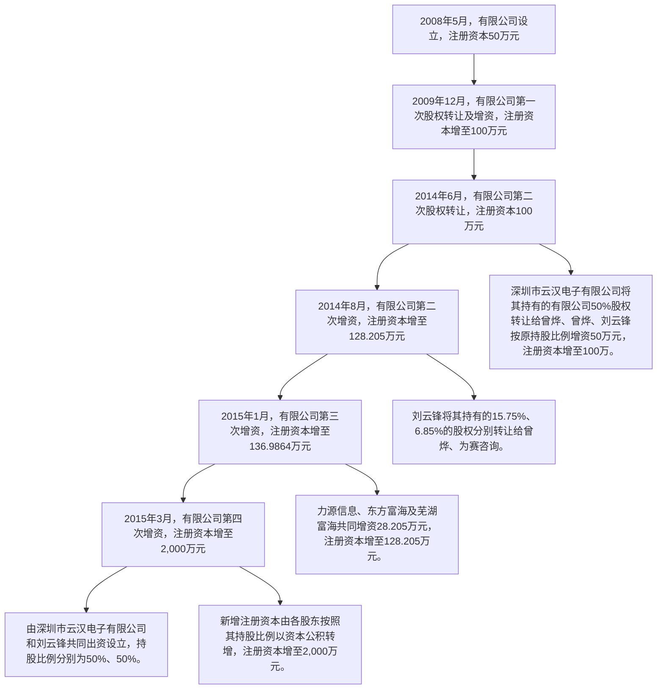
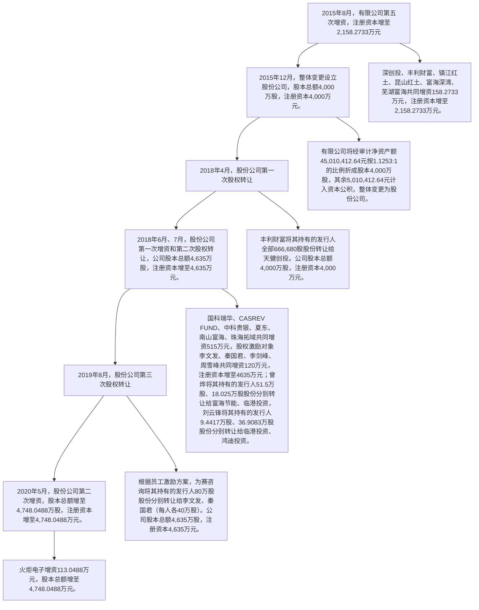

# 云汉芯城 - 融资历史候选文本

提取时间: 2026-06-05T11:44:08.889787

## 1. （2）金融资产的分类与计量

原文长度: 1,099 字符

```
# （2）金融资产的分类与计量

公司在初始确认时根据管理金融资产的业务模式和金融资产的合同现金流量特征，将金融资产分类为：以摊余成本计量的金融资产、以公允价值计量且其变动计入当期损益的金融资产、以公允价值计量且其变动计入其他综合收益的金融资产。除非公司改变管理金融资产的业务模式，在此情形下，所有受影响的相关金融资产在业务模式发生变更后的首个报告期间的第一天进行重分类，否则金融资产在初始确认后不得进行重分类。

金融资产在初始确认时以公允价值计量。对于以公允价值计量且其变动计入当期损益的金融资产，相关交易费用直接计入当期损益，其他类别的金融资产相关交易费用计入其初始确认金额。因销售商品或提供劳务而产生的、未包含或不考虑重大融资成分的应收票据及应收账款，公司则按照收入准则定义的交易价格进行初始计量。

金融资产的后续计量取决于其分类：

①以摊余成本计量的金融资产

金融资产同时符合下列条件的，分类为以摊余成本计量的金融资产：公司管理该金融资产的业务模式是以收取合同现金流量为目标；该金融资产的合同条款规定，在特定日期产生的现金流量，仅为对本金和以未偿付本金金额为基础的利息的支付。对于此类金融资产，采用实际利率法，按照摊余成本进行后续计量，其终止确认、按实际利率法摊销或减值产生的利得或损失，均计入当期损益。

②以公允价值计量且其变动计入其他综合收益的金融资产

金融资产同时符合下列条件的，分类为以公允价值计量且其变动计入其他综合收益的金融资产：公司管理该金融资产的业务模式是既以收取合同现金流量为目标又以出售金融资产为目标；该金融资产的合同条款规定，在特定日期产生的现金流量，仅为对本金和以未偿付本金金额为基础的利息的支付。对于此类金融资产，采用公允价值进行后续计量。除减值损失或利得及汇兑损益确认为当期损益外，此类金融资产的公允价值变动作为其他综合收益确认，直到该金融资产终止确认时，其累计利得或损失转入当期损益。但是采用实际利率法计算的该金融资产的相关利息收入计入当期损益。

公司不可撤销地选择将部分非交易性权益工具投资指定为以公允价值计量且其变动计入其他综合收益的金融资产，仅将相关股利收入计入当期损益，公允价值变动作为其他综合收益确认，直到该金融资产终止确认时，其累计利得或损失转入留存收益。

③以公允价值计量且其变动计入当期损益的金融资产

上述以摊余成本计量的金融资产和以公允价值计量且其变动计入其他综合收益的金融资产之外的金融资产，分类为以公允价值计量且其变动计入当期损益的金融资产。对于此类金融资产，采用公允价值进行后续计量，所有公允价

值变动计入当期损益。
```

---

## 2. （7）金融资产和金融负债的抵销

原文长度: 187 字符

```
# （7）金融资产和金融负债的抵销

金融资产和金融负债应当在资产负债表内分别列示，不得相互抵销。但同时满足下列条件的，以相互抵销后的净额在资产负债表内列示：

公司具有抵销已确认金额的法定权利，且该种法定权利是当前可执行的；

公司计划以净额结算，或同时变现该金融资产和清偿该金融负债。

不满足终止确认条件的金融资产转移，转出方不得将已转移的金融资产和相关负债进行抵销。
```

---

## 3. ②融资租赁

原文长度: 156 字符

```
# ②融资租赁

在租赁开始日，公司按照租赁投资净额（未担保余值和租赁期开始日尚未收到的租赁收款额按照租赁内含利率折现的现值之和）确认应收融资租赁款，并终止确认融资租赁资产。在租赁期的各个期间，公司按照租赁内含利率计算并确认利息收入。

公司取得的未纳入租赁投资净额计量的可变租赁付款额在实际发生时计入当期损益。
```

---

## 4. 2、应收票据与应收款项融资

原文长度: 2,044 字符

```
# 2、应收票据与应收款项融资

根据企业会计准则的相关列报要求，2019 年起，持有的由信用等级较高银行承兑的银行承兑汇票，计入应收款项融资科目。

（1）报告期各期末，公司应收票据及应收款项融资情况如下：

单位：万元

<table><tr><td rowspan="2">项目</td><td colspan="2">2024-12-31</td><td colspan="2">2023-12-31</td><td colspan="2">2022-12-31</td></tr><tr><td>账面余额</td><td>坏账准备</td><td>账面余额</td><td>坏账准备</td><td>账面余额</td><td>坏账准备</td></tr><tr><td>银行承兑汇票</td><td>4,904.80</td><td>49.05</td><td>3,297.58</td><td>32.98</td><td>5,238.92</td><td>55.27</td></tr><tr><td>商业承兑汇票</td><td>798.81</td><td>47.73</td><td>2,353.00</td><td>52.09</td><td>1,859.21</td><td>145.86</td></tr><tr><td>财务公司承兑汇票</td><td>105.56</td><td>1.06</td><td>190.82</td><td>1.91</td><td>196.02</td><td>1.96</td></tr><tr><td>应收票据合计</td><td>5,809.18</td><td>97.84</td><td>5,841.39</td><td>86.98</td><td>7,294.15</td><td>203.09</td></tr><tr><td>信用等级较高的银行承兑汇票</td><td>162.84</td><td>-</td><td>3,957.21</td><td>-</td><td>1,533.11</td><td>-</td></tr><tr><td>应收款项融资合计</td><td>162.84</td><td>-</td><td>3,957.21</td><td>-</td><td>1,533.11</td><td>-</td></tr></table>

票据是公司与客户重要的款项结算方式之一。公司参考历史信用损失经验，结合当前状况以及对未来经济状况的预测，通过违约风险敞口和整个存续期预期信用损失率，计算预期信用损失。公司所持有的由信用等级较高银行承兑的银行承兑汇票，信用风险和延期付款风险很小，故未计提减值准备。

（2）报告期各期末，公司已背书或贴现但尚未到期的应收票据如下：

单位：万元

<table><tr><td rowspan="2">种类</td><td colspan="2">2024-12-31</td><td colspan="2">2023-12-31</td><td colspan="2">2022-12-31</td></tr><tr><td>期末终止确认金额</td><td>期末未终止确认金额</td><td>期末终止确认金额</td><td>期末未终止确认金额</td><td>期末终止确认金额</td><td>期末未终止确认金额</td></tr><tr><td>银行承兑汇票</td><td>-</td><td>2,424.15</td><td>-</td><td>271.98</td><td>-</td><td>71.00</td></tr><tr><td>合计</td><td>-</td><td>2,424.15</td><td>-</td><td>271.98</td><td>-</td><td>71.00</td></tr></table>

（3）报告期各期末，公司已背书或贴现但尚未到期的应收款项融资如下：

单位：万元

<table><tr><td rowspan="2">种类</td><td colspan="2">2024-12-31</td><td colspan="2">2023-12-31</td><td colspan="2">2022-12-31</td></tr><tr><td>期末终止确认金额</td><td>期末未终止确认金额</td><td>期末终止确认金额</td><td>期末未终止确认金额</td><td>期末终止确认金额</td><td>期末未终止确认金额</td></tr><tr><td>银行承兑汇票</td><td>7,575.47</td><td>-</td><td>1,092.55</td><td>-</td><td>5,543.49</td><td>-</td></tr></table>
```

---

## 5. 二、融资必要性及募集资金使用规划

原文长度: 235 字符

```
# 二、融资必要性及募集资金使用规划

本次募集资金主要投向“大数据中心及元器件交易平台升级项目”、“电子产业协同制造服务平台建设项目” 和“智能共享仓储建设项目”三个项目，均符合公司主营业务的发展方向。

“大数据中心及元器件交易平台升级项目”和“电子产业协同制造服务平台建设项目”有助于对公司原有线上商城升级，提升其服务能力和效率，以增强客户体验。“智能共享仓储建设项目”能够为公司主营业务提供基础设施支持，扩大仓储容量和周转能力、提高仓储作业效率，以及时响应客户。
```

---

## 6. 一、发行人基本情况

原文长度: 1,079 字符

```
# 一、发行人基本情况

<table><tr><td>公司名称</td><td>云汉芯城(上海)互联网科技股份有限公司</td></tr><tr><td>英文名称</td><td>ICkey (Shanghai) Internet and Technology Co., Ltd.</td></tr><tr><td>注册资本</td><td>4,883.7074万元</td></tr><tr><td>统一社会信用代码</td><td>913100006746031318</td></tr><tr><td>法定代表人</td><td>曾烨</td></tr><tr><td>有限公司成立日期</td><td>2008年5月7日</td></tr><tr><td>股份公司设立日期</td><td>2015年12月3日</td></tr><tr><td>住所</td><td>上海漕河泾开发区松江高科技园莘砖公路258号32幢1101室</td></tr><tr><td>经营范围</td><td>许可项目:第二类医疗器械生产。(依法须经批准的项目,经相关部门批准后方可开展经营活动,具体经营项目以相关部门批准文件或许可证件为准)一般项目:互联网科技、物联网科技、电子科技领域内的技术开发、技术咨询、技术服务、技术转让,设计、制作各类广告,利用自有媒体发布各类广告,集成电器、模块电路、电子元器件、接插件、通讯器材、仪器仪表、五金交电、包装材料批发零售,从事货物及技术的进出口业务,电子产品、计算机硬件及配件、通讯器材的网上零售,第二类医疗器械研发,第二类医疗器械零售、批发。(除依法须经批准的项目外,凭营业执照依法自主开展经营活动)</td></tr><tr><td>邮政编码</td><td>201612</td></tr><tr><td>公司电话</td><td>021-31029123</td></tr><tr><td>公司传真</td><td>021-64821570</td></tr><tr><td>网址</td><td>http://www.ickey.cn</td></tr><tr><td>电子信箱</td><td>ad@ickey.cn</td></tr><tr><td>负责信息披露和投资者关系的部门</td><td>董事会办公室</td></tr><tr><td>董事会秘书</td><td>周雪峰</td></tr><tr><td>董事会办公室电话</td><td>021-31029123</td></tr></table>
```

---

## 7. （三）云汉有限设立以来股本演变情况

原文长度: 1,816 字符

```
# （三）云汉有限设立以来股本演变情况


<details>
<summary>flowchart</summary>


</details>

（转下图）

（续上图）  


<details>
<summary>flowchart</summary>


</details>
```

---

## 8. （一）2018年 4月，股份公司第一次股权转让

原文长度: 1,313 字符

```
# （一）2018年 4月，股份公司第一次股权转让

2018年 4月 28日，丰利财富与天健创投签署了《关于云汉芯城（上海）互联网科技股份有限公司股份转让协议》，约定丰利财富将其持有的云汉芯城全部 666,680股股份（占总股本的 1.67%）转让给天健创投，转让价格系按照丰利财富 2015 年入股云汉有限时的投资总额 1,000 万元确定。丰利财富系代表其管理的丰利财富新三板成长基金（以下简称“丰利新三板基金”）投资发行人，资金来源为丰利新三板基金的募集资金。由于 2018 年丰利新三板基金拟转让发行人股份时，其存续期限已临近届满，基金所投资的项目退出压力较大，急于寻找退出的渠道，因此丰利财富同意按其出资时的价格 1000 万元将持有发行人的股份转让给天健创投。

新增股东天健创投主营业务为创业投资，与公司主营业务不存在相似或相同的情况，非三类股东。东方富海（芜湖）股权投资基金管理企业（有限合伙）和厦门蜜呆资产管理合伙企业（有限合伙）为其普通合伙人，其中蜜呆资管为其执行事务合伙人，实际控制人为徐珊。

本次股权转让后，公司股权结构如下：

<table><tr><td>序号</td><td>股东姓名/名称</td><td>持股数量(股)</td><td>持股比例(%)</td></tr><tr><td>1</td><td>曾烨</td><td>17,792,000</td><td>44.48</td></tr><tr><td>2</td><td>刘云锋</td><td>7,413,360</td><td>18.53</td></tr><tr><td>3</td><td>力源信息</td><td>5,004,000</td><td>12.51</td></tr><tr><td>4</td><td>芜湖富海</td><td>2,835,320</td><td>7.09</td></tr><tr><td>5</td><td>东方富海</td><td>2,502,000</td><td>6.26</td></tr><tr><td>6</td><td>为赛咨询</td><td>1,853,360</td><td>4.63</td></tr><tr><td>7</td><td>深创投</td><td>933,320</td><td>2.33</td></tr><tr><td>8</td><td>天健创投</td><td>666,680</td><td>1.67</td></tr><tr><td>9</td><td>镇江红土</td><td>333,320</td><td>0.83</td></tr><tr><td>10</td><td>昆山红土</td><td>333,320</td><td>0.83</td></tr><tr><td>11</td><td>富海深湾</td><td>333,320</td><td>0.83</td></tr><tr><td colspan="2">合计</td><td>40,000,000</td><td>100.00</td></tr></table>
```

---

## 9. （二）2018 年 6 月至 7 月，股份公司增加注册资本暨第二次股权转让

原文长度: 2,843 字符

```
# （二）2018 年 6 月至 7 月，股份公司增加注册资本暨第二次股权转让

2018 年 6 月 12 日，发行人与国科瑞华、CASREV FUND、中科贵银、夏东、南山富海、珠海拓域、曾烨、刘云锋、为赛咨询、力源信息、东方富海、芜湖富海、深创投、天健创投、镇江红土、昆山红土、富海深湾、富海节能、临港投资、鸿迪投资签署了《关于云汉芯城（上海）互联网科技股份有限公司之增资与股权转让协议》，约定该协议相关方对发行人增资，以及受让发行人股份事宜。根据该协议，国科瑞华以现金 7,412 万元认缴新增注册资本 254.4787 万元；CASREV FUND 以现金 1,800 万元的等值美元认缴新增注册资本 61.8 万元；中科贵银以现金 1,584 万元认缴新增注册资本 54.384 万元；夏东以现金 204 万元认缴新增注册资本 7.004万元；南山富海以现金 3,000万元认缴新增注册资本103 万元；珠海拓域以现金 1,000 万元认缴新增注册资本 34.3333 万元。同时，该协议还约定，曾烨将其持有的发行人 51.5 万股股份转让予富海节能，转让价格为 1,500 万元；曾烨将其持有的发行人 18.025 万股股份转让予临港投资，转让价格为 524.9994万元；刘云锋将其持有的发行人 9.4417万股股份转让予临港投资，转让价格为 275.006万元；刘云锋将其持有的发行人 36.9083万股股份转让予鸿迪投资，转让价格为 1,075 万元。上述增资和股权转让的每股价格约为29.13元，对应发行人整体投后估值约为 13.5亿元。

发行人于 2018 年 6 月 12 日召开 2018 年第一次临时股东大会并通过决议，同意上述协议约定的发行人增资及股东转让股份事项。同时，同意对公司管理团队进行股权激励，由激励对象李文发、秦国君、李剑峰、周雪峰认缴发行人新增注册资本共计 120万元，每股价格 1元。其中，李文发以现金 20万元认缴新增注册资本 20万元；秦国君以现金 20万元认缴新增注册资本 20万元；李剑峰以现金 20万元认缴新增注册资本 20万元；周雪峰以现金 60万元认缴新增注册资本60万元。

2018年 6月 28日，发行人就夏东、南山富海、珠海拓域、李文发、秦国君、李剑峰、周雪峰向发行人增资事宜办理完成工商变更登记，发行人的注册资本由 4,000 万元增至 4,264.3373 万元。

2018年7月27日，发行人就国科瑞华、CASREV FUND、中科贵银向发行人增资事宜办理完成工商变更登记。发行人的注册资本由 4,264.3373 万元增至4,635 万元。

2020 年 12 月 16 日，容诚会计师出具了《验资报告》（容诚验字[2020]361Z0117号），对本次增资进行了验证。

本次变更完成后，公司的股权结构如下：

<table><tr><td>序号</td><td>股东姓名/名称</td><td>持股数量(股)</td><td>持股比例(%)</td></tr><tr><td>1</td><td>曾烨</td><td>17,096,750</td><td>36.89</td></tr><tr><td>2</td><td>刘云锋</td><td>6,949,860</td><td>14.99</td></tr><tr><td>3</td><td>力源信息</td><td>5,004,000</td><td>10.80</td></tr><tr><td>4</td><td>芜湖富海</td><td>2,835,320</td><td>6.12</td></tr><tr><td>5</td><td>国科瑞华</td><td>2,544,787</td><td>5.49</td></tr><tr><td>6</td><td>东方富海</td><td>2,502,000</td><td>5.40</td></tr><tr><td>7</td><td>为赛咨询</td><td>1,853,360</td><td>4.00</td></tr><tr><td>8</td><td>南山富海</td><td>1,030,000</td><td>2.22</td></tr><tr><td>9</td><td>深创投</td><td>933,320</td><td>2.01</td></tr><tr><td>10</td><td>天健创投</td><td>666,680</td><td>1.44</td></tr><tr><td>11</td><td>CASREV FUND</td><td>618,000</td><td>1.33</td></tr><tr><td>12</td><td>周雪峰</td><td>600,000</td><td>1.29</td></tr><tr><td>13</td><td>中科贵银</td><td>543,840</td><td>1.17</td></tr><tr><td>14</td><td>富海节能</td><td>515,000</td><td>1.11</td></tr><tr><td>15</td><td>鸿迪投资</td><td>369,083</td><td>0.80</td></tr><tr><td>16</td><td>珠海拓域</td><td>343,333</td><td>0.74</td></tr><tr><td>17</td><td>富海深湾</td><td>333,320</td><td>0.72</td></tr><tr><td>18</td><td>镇江红土</td><td>333,320</td><td>0.72</td></tr><tr><td>19</td><td>昆山红土</td><td>333,320</td><td>0.72</td></tr><tr><td>20</td><td>临港投资</td><td>274,667</td><td>0.59</td></tr><tr><td>21</td><td>李文发</td><td>200,000</td><td>0.43</td></tr><tr><td>22</td><td>李剑峰</td><td>200,000</td><td>0.43</td></tr><tr><td>23</td><td>秦国君</td><td>200,000</td><td>0.43</td></tr><tr><td>24</td><td>夏东</td><td>70,040</td><td>0.15</td></tr><tr><td colspan="2">合计</td><td>46,350,000</td><td>100.00</td></tr></table>
```

---

## 10. （三）2019年 8月，股份公司第三次股权转让

原文长度: 1,911 字符

```
# （三）2019年 8月，股份公司第三次股权转让

2019 年 8 月 13 日，为赛咨询与李文发、秦国君分别签署了《股份转让协议》。根据该协议，李文发以 40 万元的价格受让为赛咨询持有的发行人股份40 万股，秦国君以 40 万元的价格受让为赛咨询持有的发行人股份 40 万股。同时，李文发、秦国君与为赛咨询其他合伙人签署了《退伙协议书》，两人于2019年 8月 12日将其依据 2017年公司员工激励方案以 40万元的价格各取得的为赛咨询21.58%的财产份额转出，进而从为赛咨询退伙。

本次转让后，公司的股权结构如下：

<table><tr><td>序号</td><td>股东姓名/名称</td><td>持股数量(股)</td><td>持股比例(%)</td></tr><tr><td>1</td><td>曾烨</td><td>17,096,750</td><td>36.89</td></tr><tr><td>2</td><td>刘云锋</td><td>6,949,860</td><td>14.99</td></tr><tr><td>3</td><td>力源信息</td><td>5,004,000</td><td>10.80</td></tr><tr><td>4</td><td>芜湖富海</td><td>2,835,320</td><td>6.12</td></tr><tr><td>5</td><td>国科瑞华</td><td>2,544,787</td><td>5.49</td></tr><tr><td>6</td><td>东方富海</td><td>2,502,000</td><td>5.40</td></tr><tr><td>7</td><td>为赛咨询</td><td>1,053,360</td><td>2.27</td></tr><tr><td>8</td><td>南山富海</td><td>1,030,000</td><td>2.22</td></tr><tr><td>9</td><td>深创投</td><td>933,320</td><td>2.01</td></tr><tr><td>10</td><td>天健创投</td><td>666,680</td><td>1.44</td></tr><tr><td>11</td><td>CASREV FUND</td><td>618,000</td><td>1.33</td></tr><tr><td>12</td><td>周雪峰</td><td>600,000</td><td>1.29</td></tr><tr><td>13</td><td>李文发</td><td>600,000</td><td>1.29</td></tr><tr><td>14</td><td>秦国君</td><td>600,000</td><td>1.29</td></tr><tr><td>15</td><td>中科贵银</td><td>543,840</td><td>1.17</td></tr><tr><td>16</td><td>富海节能</td><td>515,000</td><td>1.11</td></tr><tr><td>17</td><td>鸿迪投资</td><td>369,083</td><td>0.80</td></tr><tr><td>18</td><td>珠海拓域</td><td>343,333</td><td>0.74</td></tr><tr><td>19</td><td>镇江红土</td><td>333,320</td><td>0.72</td></tr><tr><td>20</td><td>昆山红土</td><td>333,320</td><td>0.72</td></tr><tr><td>21</td><td>富海深湾</td><td>333,320</td><td>0.72</td></tr><tr><td>22</td><td>临港投资</td><td>274,667</td><td>0.59</td></tr><tr><td>23</td><td>李剑峰</td><td>200,000</td><td>0.43</td></tr><tr><td>24</td><td>夏东</td><td>70,040</td><td>0.15</td></tr><tr><td colspan="2">合计</td><td>46,350,000</td><td>100.00</td></tr></table>
```

---

## 11. （五）2020年 9月，股份公司第三次增资和第四次股权转让

原文长度: 3,486 字符

```
# （五）2020年 9月，股份公司第三次增资和第四次股权转让

2020 年 9 月 15 日，发行人召开 2020 年第三次临时股东大会并通过决议，同意发行人的注册资本由 4,748.0488 万元增至 4,883.7074 万元。其中，厦门西堤以 5,000.00 万元认购公司新增股份 96.899 万股，96.899 万元计入股本，剩余部分计入资本公积；中小企业基金以 2,000.00 万元认购新增股份 38.7596 万股，38.7596万元计入股本，剩余部分计入资本公积。

2020 年 12 月 16 日，容诚会计师出具了《验资报告》（容诚验字

[2020]361Z0117 号），对本次增资进行了验证。

此外，公司股东曾烨、刘云锋、秦国君、李文发与郦韩英、沈笑彦、衣嘉平、余满芬、崔振南、鸿迪投资、福建开京、湘裕君源等 8 位自然人、法人主体签署股份转让协议，转让股份合计 1,659,535股，具体情况如下：

<table><tr><td>转让方</td><td>受让方</td><td>转让股数(股)</td><td>转让价格(万元)</td></tr><tr><td rowspan="2">曾烨</td><td>鸿迪投资</td><td>480,000.00</td><td>2,476.80</td></tr><tr><td>郦韩英</td><td>484,495.00</td><td>2,499.99</td></tr><tr><td rowspan="6">刘云锋</td><td>福建开京</td><td>116,280.00</td><td>600.00</td></tr><tr><td>沈笑彦</td><td>85,000.00</td><td>438.60</td></tr><tr><td>衣嘉平</td><td>85,000.00</td><td>438.60</td></tr><tr><td>余满芬</td><td>85,000.00</td><td>438.60</td></tr><tr><td>崔振南</td><td>38,760.00</td><td>200.00</td></tr><tr><td>湘裕君源</td><td>85,000.00</td><td>438.60</td></tr><tr><td>李文发</td><td>湘裕君源</td><td>50,000.00</td><td>258.00</td></tr><tr><td>秦国君</td><td>湘裕君源</td><td>150,000.00</td><td>774.00</td></tr></table>

2020年9月23日，股份公司在上海市市场监督管理局完成了变更登记。

此次增资及股权转让的每股价格约为 51.6 元，对应发行人整体投后估值约为25.2亿。本次变更完成后，发行人的股权结构如下：

<table><tr><td>序号</td><td>股东姓名/名称</td><td>持股数量(股)</td><td>持股比例(%)</td></tr><tr><td>1</td><td>曾烨</td><td>16,132,255</td><td>33.03</td></tr><tr><td>2</td><td>刘云锋</td><td>6,454,820</td><td>13.22</td></tr><tr><td>3</td><td>力源信息</td><td>5,004,000</td><td>10.25</td></tr><tr><td>4</td><td>芜湖富海</td><td>2,835,320</td><td>5.81</td></tr><tr><td>5</td><td>国科瑞华</td><td>2,544,787</td><td>5.21</td></tr><tr><td>6</td><td>东方富海</td><td>2,502,000</td><td>5.12</td></tr><tr><td>7</td><td>火炬电子</td><td>1,130,488</td><td>2.31</td></tr><tr><td>8</td><td>为赛咨询</td><td>1,053,360</td><td>2.16</td></tr><tr><td>9</td><td>南山富海</td><td>1,030,000</td><td>2.11</td></tr><tr><td>10</td><td>厦门西堤</td><td>968,990</td><td>1.98</td></tr><tr><td>11</td><td>深创投</td><td>933,320</td><td>1.91</td></tr><tr><td>12</td><td>鸿迪投资</td><td>849,083</td><td>1.74</td></tr><tr><td>13</td><td>天健创投</td><td>666,680</td><td>1.37</td></tr><tr><td>14</td><td>CASREV FUND</td><td>618,000</td><td>1.27</td></tr><tr><td>15</td><td>周雪峰</td><td>600,000</td><td>1.23</td></tr><tr><td>16</td><td>李文发</td><td>550,000</td><td>1.13</td></tr><tr><td>17</td><td>中科贵银</td><td>543,840</td><td>1.11</td></tr><tr><td>18</td><td>富海节能</td><td>515,000</td><td>1.05</td></tr><tr><td>19</td><td>郦韩英</td><td>484,495</td><td>0.99</td></tr><tr><td>20</td><td>秦国君</td><td>450,000</td><td>0.92</td></tr><tr><td>21</td><td>中小企业基金</td><td>387,596</td><td>0.79</td></tr><tr><td>22</td><td>珠海拓域</td><td>343,333</td><td>0.70</td></tr><tr><td>23</td><td>富海深湾</td><td>333,320</td><td>0.68</td></tr><tr><td>24</td><td>镇江红土</td><td>333,320</td><td>0.68</td></tr><tr><td>25</td><td>昆山红土</td><td>333,320</td><td>0.68</td></tr><tr><td>26</td><td>湘裕君源</td><td>285,000</td><td>0.58</td></tr><tr><td>27</td><td>临港投资</td><td>274,667</td><td>0.56</td></tr><tr><td>28
```

---

## 12. ①融资渠道单一

原文长度: 213 字符

```
# ①融资渠道单一

公司所处领域系电子元器件分销与产业互联网融合领域，具有新技术发展速度、市场变化较快的特点，公司未来的发展离不开底层支持技术的迭代升级、综合服务的深挖拓展。因此，公司必须储备大量的资金，保障在技术研发、系统运营、市场营销、人才引进等方面的持续资金投入，以确保始终保持市场的领先地位。目前，公司尚未登陆国内 A 股市场，融资渠道相对狭窄，资本积累规模相对较小，制约着公司信息技术实力与综合服务能力的快速提高。
```

---

## 13. （三）融资合同

原文长度: 1,405 字符

```
# （三）融资合同

截至 2025 年 2 月 28 日，发行人正在履行中的金额 500 万元以上的主要授信借款合同及其担保合同如下：

1、云汉电子与星展银行上海分行于 2022 年 12 月 5 日签署了编号为

P/SH/BT/38131/22 号的《授信函》，根据该授信函及其补充函件，星展银行上海分行向云汉电子提供人民币 7,000 万元或等值美元的信贷额度，每笔最长融资期限为360日。

就前述授信协议，由云汉芯城按照编号为 CG/SH/BT/38131/22 的《最高额保证合同》提供连带责任保证担保，担保的最高债权额度为 7,700 万元（最高债权额度并不意味着主合同项下的债权本金额度，债务人在主合同项下的债权本金金额以及相关权利和义务应以主合同为准），担保范围是借款本金、利息、罚息、违约金、赔偿金和实现债权的费用等。

2、云汉电子与上海银行松江支行于 2024 年 4 月 28 日签署了编号为231240093 号的《综合授信合同》，约定上海银行松江支行向云汉电子提供 2亿元等值人民币的最高授信额度，授信期限自 2024年 4月 28日至 2025年 4月24 日。基于该授信协议，云汉电子已与上海银行松江支行签署了编号为23124009301 的《流动资金循环借款合同》，该合同项下循环借款额度为 2,000万元，借款期限自2024年5月6日起至2025年 4月24日止。

就前述授信协议，由云汉芯城按照编号为 ZDB231240093 的《最高额保证合同》提供连带责任保证担保，保证范围为主合同项下的债权本金、利息、罚息、复利、违约金、损害赔偿金和实现债权的费用等。

3、云汉电子与中信银行上海分行于 2024年 4月 29日签署了编号为（2024）沪银融字第 202404-157 号《中信银行“信 e 融”业务合作协议》，约定中信银行上海分行向云汉电子提供最高额为 5,000 万元的贷款额度，协议有效期自2024 年 4 月 29 日至 2025 年 3 月 28 日。

就前述授信协议，由云汉芯城按照编号为（2023）沪银最保字第 202304-184002 号的《最高额保证合同》提供连带责任保证担保，担保的最高债权额为3 亿元整。

4、云汉电子与北京银行上海分行于 2024 年 6 月 11 日签署了编号为0922167 号的《综合授信合同》，约定北京银行上海分行向云汉电子提供 2 亿元等值人民币的最高授信额度，授信期限自合同订立日 2024 年 6 月 11 日起至2026 年 6 月 10 日。

就前述授信协议，由云汉芯城按照编号为 0922167\_001 的《最高额保证合同》提供担保，保证范围为主合同项下的债权本金、利息、罚息、复利、违约金、损害赔偿金和担保权益的费用等。

5、云汉电子与招商银行上海分行于 2025 年 2 月 18 日签署了编号为121XY250211T000061 的《授信协议》，约定招商银行上海分行向云汉电子提供 10,000万元的授信额度，授信期限自 2025年 2月 18日至 2026年 2月 17日。

就前述授信协议，由云汉芯城按照编号为 121XY250211T000061 的《最高额不可撤销担保书》提供连带责任保证担保，保证范围为主合同项下的债务本金、利息、罚息、复息、违约金、迟延履行金等。
```

---

