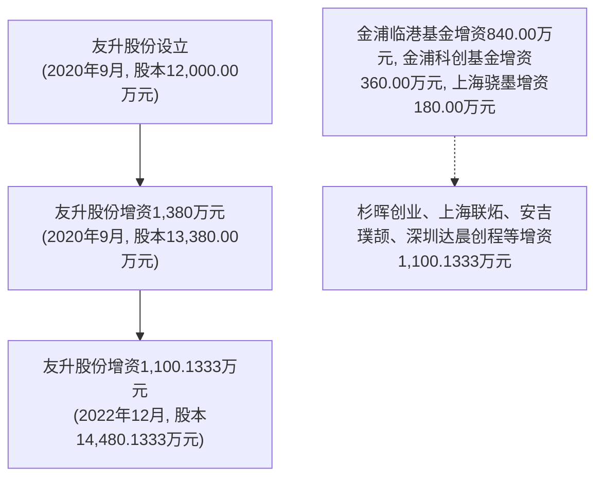

# 友声股份 - 融资历史候选文本

提取时间: 2026-06-05T11:44:08.889990

## 1. 2、应收票据及应收款项融资

原文长度: 838 字符

```
# 2、应收票据及应收款项融资

报告期各期末，公司应收票据及应收款项融资账面价值情况如下：

单位：万元

<table><tr><td>项目</td><td>2024.12.31</td><td>2023.12.31</td><td>2022.12.31</td></tr><tr><td>应收票据</td><td>39,935.82</td><td>15,974.82</td><td>13,134.55</td></tr><tr><td>其中:银行承兑汇票</td><td>16,825.08</td><td>4,937.50</td><td>11,774.38</td></tr><tr><td>商业承兑汇票</td><td>23,110.74</td><td>11,037.33</td><td>1,360.17</td></tr><tr><td>应收款项融资</td><td>10,605.17</td><td>13,967.31</td><td>3,391.35</td></tr><tr><td>其中:银行承兑汇票</td><td>10,605.17</td><td>13,967.31</td><td>3,391.35</td></tr><tr><td>合计</td><td>50,541.00</td><td>29,942.13</td><td>16,525.90</td></tr></table>

报告期各期末，公司应收票据及应收款项融资合计金额分别为 16,525.90 万元、29,942.13 万元和 50,541.00 万元。报告期内，公司应收票据及应收款项融资金额不断增加，主要原因为：（1）公司经营规模不断增加，主要客户以银行承兑汇票结算货款的金额增加；（2）公司对宁德时代销售增加，宁德时代以开立的融单进行结算，导致商业承兑汇票增加。公司应收款项融资变动主要受到北汽新能源、长安汽车、吉利集团等以高信用等级的银行承兑汇票结算变化影响。
```

---

## 2. 6、融资计划

原文长度: 153 字符

```
# 6、融资计划

本次募集资金到位后，可初步满足公司现阶段的投资项目资金需求。公司力争提高资金利用效率，以保证公司的持续、健康发展，实现广大投资者收益的最大化。随着经营业务的持续发展和规模的逐步壮大，公司将选择适当的时机和合理的方式利用资本市场实施再融资计划，从而为公司实现跨越式发展奠定坚实的经济基础。
```

---

## 3. （四）融资租赁合同

原文长度: 2,380 字符

```
# （四）融资租赁合同

截至本招股说明书签署日，发行人及其子公司已经履行和正在履行超过的金额超过1,000万元的融资租赁合同如下：

<table><tr><td>序号</td><td>承租方</td><td>出租方</td><td>合同编号</td><td>合同签订日期</td><td>合同期限</td><td>租赁标的</td><td>合同金额(万元)</td><td>担保情况</td><td>是否履行完毕</td></tr><tr><td>1</td><td>山东友升</td><td>平安国际融资租赁有限公司</td><td>2021PAZL0102319-ZL-01</td><td>2021.9.27</td><td>24个月</td><td>挤压生产线等</td><td>1,111.11</td><td>友升股份、罗世兵提供保证担保</td><td>是</td></tr><tr><td>2</td><td>友升股份</td><td>永赢金融租赁有限公司</td><td>2021YYZL0209768-ZL-01</td><td>2021.10.12</td><td>12个月</td><td>加工中心、焊接工作站等</td><td>1,200.00</td><td>罗世兵、金丽燕提供保证担保</td><td>是</td></tr><tr><td>3</td><td>山东友升</td><td>平安国际融资租赁有限公司</td><td>2021PAZL0102322-ZL-01</td><td>2021.10.22</td><td>24个月</td><td>挤压生产线等</td><td>1,111.11</td><td>友升股份、罗世兵提供保证担保</td><td>是</td></tr><tr><td>4</td><td>山东友升</td><td>平安国际融资租赁有限公司</td><td>2021PAZL0102458-ZL-01</td><td>2021.10.22</td><td>24个月</td><td>挤压生产线等</td><td>1,111.11</td><td>友升股份、罗世兵提供保证担保</td><td>是</td></tr><tr><td>5</td><td>山东友升</td><td>平安国际融资租赁有限公司</td><td>2021PAZL0102459-ZL-01</td><td>2021.10.22</td><td>24个月</td><td>挤压生产线等</td><td>1,111.11</td><td>友升股份、罗世兵提供保证担保</td><td>是</td></tr><tr><td>6</td><td>山东友升</td><td>平安国际融资租赁有限公司</td><td>2021PAZL0103091-ZL-01</td><td>2021.12.16</td><td>13个月</td><td>CNC加工中心等</td><td>1,111.11</td><td>友升股份、罗世兵提供保证担保</td><td>是</td></tr><tr><td>7</td><td>山东友升</td><td>平安国际融资租赁有限公司</td><td>2022PAZL0101273-ZL-01</td><td>2022.6.29</td><td>26个月</td><td>立式加工中心等</td><td>1,111.10</td><td>友升股份、罗世兵提供保证担保</td><td>是</td></tr><tr><td>8</td><td>山东友升</td><td>平安国际融资租赁有限公司</td><td>2022PAZL0101347-ZL-01</td><td>2022.6.29</td><td>26个月</td><td>立式加工中心等</td><td>1,666.60</td><td>友升股份、罗世兵提供保证担保</td><td>是</td></tr><tr><td>9</td><td>山东友升</td><td>远东国际融资租赁有限公司</td><td>IFELC22DE341UC-L-01</td><td>2022.9.23</td><td>12个月</td><td>立式加工中心等</td><td>2,000.00</td><td>友升股份、罗世兵提供保证担保</td><td>是</td></tr><tr><td>10</td><td>重庆友利森</td><td>邦银金融租赁股份有限公司</td><td>BYMZZ20230061</td><td>2023.11.16</td><td>24个月</td><td>立式加工中心等</td><td>1,087.50</td><td>友升股份、罗世兵提供保证担保</td><td>否</td></tr><tr><td>11</td><td>重庆友利森</td><td>邦银金融租赁股份有限公司</td><td>BYMZZ20240002</td><td>2024.1.29</td><td>24个月</td><td>立式加工中心等</td><td>1,482.50</td><td>友升股份、罗世兵提供保证担保</td><td>否</td></tr><tr><td>12</td><td>山东友升</td><td>永赢金融租赁有限公司</td><td>2024YYZL0567984-ZL-01</td><td>2024.12.10</td><td>24个月</td><td>立式加工中心等</td><td>1,000.00</td><td>友升股份、罗世兵、金丽燕提供保证担保</td><td>否</td></tr></table>
```

---

## 4. 三、发行人本次融资的必要性及募集资金使用规划

原文长度: 310 字符

```
# 三、发行人本次融资的必要性及募集资金使用规划

在国家绿色发展战略引导、“双碳”政策目标推进以及新能源汽车技术成熟与配套设施进一步完善的背景下，未来新能源汽车、汽车轻量化、节能化已成为行业的发展趋势。铝合金汽车零部件具有轻量化、高可靠性、热稳定性强的优点，符合《新能源汽车产业发展规划（2021—2035 年）》规定的关键材料产业化应用。公司长期专注于铝合金汽车零部件研发及生产，需要在这一关键时期抓住机遇，扩大市场份额，提升整体竞争力。

公司规划本次募集资金用于云南友升轻量化铝合金零部件生产基地项目和年产 50 万台（套）电池托盘和 20 万套下车体制造项目，有利于完善产品布局、形成规模优势，实现高质量发展。
```

---

## 5. 第四节 发行人基本情况.... .40

原文长度: 561 字符

```
# 第四节 发行人基本情况.... .40

一、发行人基本信息. ..40

二、发行人设立情况和报告期内股本、股东变化情况. ..40

三、发行人成立以来重要事件. ..50

四、发行人在其他证券市场上市或挂牌的情况. .51

五、发行人的股权结构.. .51

六、发行人控股和参股公司情况. .51

七、持有发行人 5%以上股份的主要股东及实际控制人的基本情况 ...........57

八、控股股东、实际控制人报告期内不存在重大违法行为.. ..72

九、发行人股本情况.. ..72

十、发行人董事、监事、高级管理人员及其他核心人员的简要情况..........81

十一、公司与董事、监事、高级管理人员及其他核心人员签订的协议及履行情况... ..88

十二、公司董事、监事、高级管理人员及其他核心人员及其近亲属持股情况.. ..88

十三、公司与董事、监事、高级管理人员及其他核心人员在最近三年内的变动情况... ..90

十四、公司与董事、监事、高级管理人员及其他核心人员的对外投资情况..91

十五、董事、监事、高级管理人员及其他核心人员的薪酬情况. ... 92

十六、本次发行前发行人已制定或实施的股权激励及相关安排. ... 93

十七、发行人员工情况.. ..97
```

---

## 6. 二、发行人设立情况和报告期内股本、股东变化情况

原文长度: 483 字符

```
# 二、发行人设立情况和报告期内股本、股东变化情况

公司是由友升有限整体变更设立的股份有限公司。公司报告期内股本变化情况如下：


<details>
<summary>flowchart</summary>


</details>
```

---

## 7. （1）融资渠道有限

原文长度: 367 字符

```
# （1）融资渠道有限

汽车铝合金零部件行业在前期需要花费高额成本进行研发以及购买生产配套所使用的工装与生产设备，报告期内，公司用于购建固定资产、在建工程、无形资产而支付的资金分别为 15,641.62 万元、24,252.44 万元和 32,769.25 万元，为满足下游客户需求，公司需要持续进行资本性投入。

公司营运资金流动性偏紧，对外采购铝水、铝棒、铝型材等原材料时，结算方式以预付为主，与产品的量产及客户结算存在一定的周期。公司与主要客户信用期一般为开票后 60 日至 90 日内付款，考虑到开票结算周期一般约为一个月，因此销售至回款整体周期约 90日至120日。

上述行业特点决定了公司在产能扩张过程中需要大量的资金以满足资本性支出和营运资金需求，公司的资本实力偏弱，融资渠道有限，融资能力不足制约了公司的快速发展。
```

---

## 8. 2、金融资产分类和计量

原文长度: 369 字符

```
# 2、金融资产分类和计量

本公司的金融资产于初始确认时根据本公司管理金融资产的业务模式和金融资产的合同现金流量特征分类为：以摊余成本计量的金融资产、以公允价值计量且其变动计入其他综合收益的金融资产以及以公允价值计量且其变动计入当期损益的金融资产。金融资产的后续计量取决于其分类。

本公司对金融资产的分类，依据本公司管理金融资产的业务模式和金融资产的现金流量特征进行分类。

（1）以摊余成本计量的金融资产

金融资产同时符合下列条件的，分类为以摊余成本计量的金融资产：本公司管理该金融资产的业务模式是以收取合同现金流量为目标；该金融资产的合同条款规定，在特定日期产生的现金流量，仅为对本金和以未偿付本金金额为基础的利息的支付。对于此类金融资产，采用实际利率法，按照摊余成本进行后续计量，其摊销或减值产生的利得或损失，均计入当期损益。
```

---

## 9. （4）以公允价值计量且其变动计入当期损益的金融资产

原文长度: 306 字符

```
# （4）以公允价值计量且其变动计入当期损益的金融资产

上述以摊余成本计量的金融资产和以公允价值计量且其变动计入其他综合收益的金融资产之外的金融资产，分类为以公允价值计量且其变动计入当期损益的金融资产。在初始确认时，为了能够消除或显著减少会计错配，可以将金融资产指定为以公允价值计量且其变动计入当期损益的金融资产。对于此类金融资产，采用公允价值进行后续计量，所有公允价值变动计入当期损益。

当且仅当本公司改变管理金融资产的业务模式时，才对所有受影响的相关金融资产进行重分类。

对于以公允价值计量且其变动计入当期损益的金融资产，相关交易费用直接计入当期损益，其他类别的金融资产相关交易费用计入其初始确认金额。
```

---

## 10. 5、金融资产减值

原文长度: 239 字符

```
# 5、金融资产减值

本公司对于以摊余成本计量的金融资产、以公允价值计量且其变动计入其他综合收益的债务工具投资和财务担保合同等，以预期信用损失为基础确认损失准备。信用损失，是指本公司按照原实际利率折现的、根据合同应收的所有合同现金流量与预期收取的所有现金流量之间的差额，即全部现金短缺的现值。

本公司考虑所有合理且有依据的信息，包括前瞻性信息，以单项或组合的方式对以摊余成本计量的金融资产和以公允价值计量且其变动计入其他综合收益的金融资产（债务工具）的预期信用损失进行估计。
```

---

## 11. 6、金融资产转移

原文长度: 308 字符

```
# 6、金融资产转移

本公司已将金融资产所有权上几乎所有的风险和报酬转移给转入方的，终止确认该金融资产；保留了金融资产所有权上几乎所有的风险和报酬的，不终止确认该金融资产。

本公司既没有转移也没有保留金融资产所有权上几乎所有的风险和报酬的，分别下列情况处理：放弃了对该金融资产控制的，终止确认该金融资产并确认产生的资产和负债；未放弃对该金融资产控制的，按照其继续涉入所转移金融资产的程度确认有关金融资产，并相应确认有关负债。

通过对所转移金融资产提供财务担保方式继续涉入的，按照金融资产的账面价值和财务担保金额两者之中的较低者，确认继续涉入形成的资产。财务担保金额，是指所收到的对价中，将被要求偿还的最高金额。
```

---

