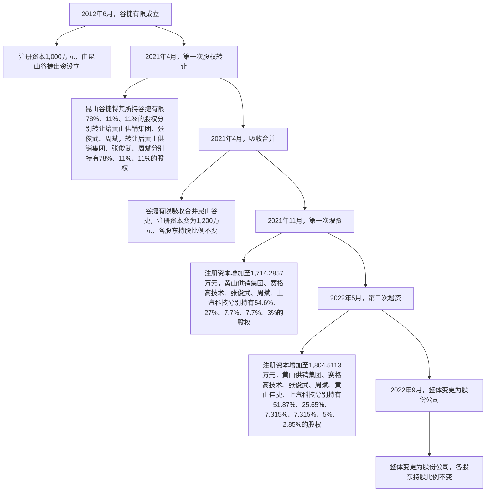
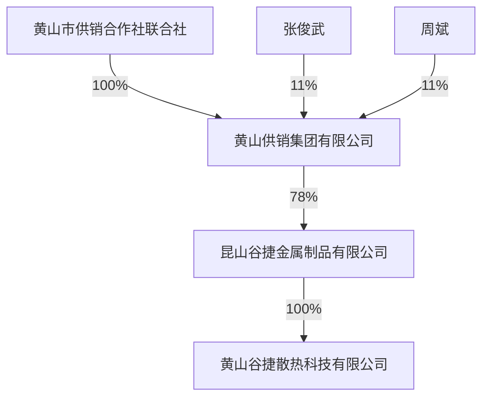
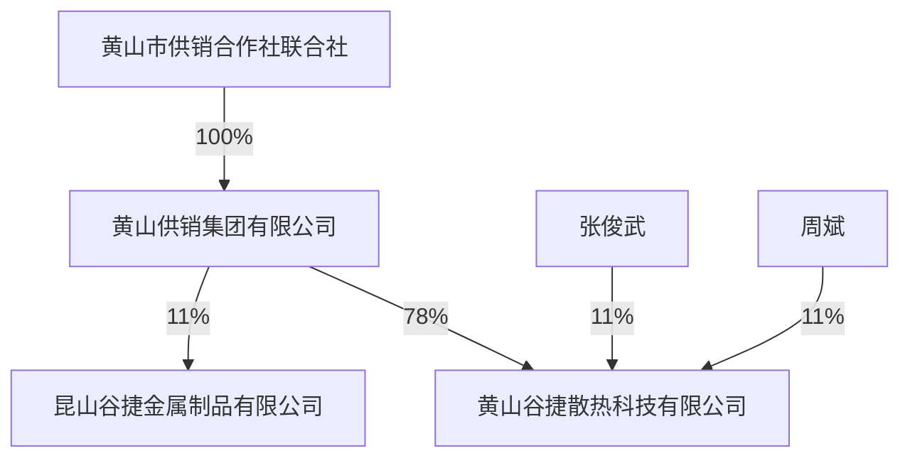

# 黄山谷捷 - 融资历史候选文本

提取时间: 2026-06-05T11:44:08.893124

## 1. 2、应收票据及应收款项融资

原文长度: 2,274 字符

```
# 2、应收票据及应收款项融资

报告期各期末，公司应收票据及应收款项融资的构成情况如下：

单位：万元

<table><tr><td>项目</td><td>2024.6.30</td><td>2023.12.31</td><td>2022.12.31</td><td>2021.12.31</td></tr><tr><td>应收票据</td><td>2,920.87</td><td>2,445.13</td><td>1,882.61</td><td>509.60</td></tr><tr><td>其中:银行承兑汇票</td><td>2,350.98</td><td>2,445.13</td><td>1,882.61</td><td>509.60</td></tr><tr><td>商业承兑汇票</td><td>569.89</td><td>-</td><td>-</td><td>-</td></tr><tr><td>应收款项融资</td><td>7,247.09</td><td>2,153.98</td><td>-</td><td>111.87</td></tr><tr><td>其中:银行承兑汇票</td><td>7,247.09</td><td>2,153.98</td><td>-</td><td>111.87</td></tr><tr><td>合计</td><td>10,167.96</td><td>4,599.11</td><td>1,882.61</td><td>621.47</td></tr></table>

公司根据公开信息披露的票据违约情况、《中国银保监会办公厅关于进一步加强企业集团财务公司票据业务监管的通知》（银保监办发【2019】133号）并参考《上市公司执行企业会计准则案例解析（2019）》等文件，遵照谨慎性原则对银行承兑汇票承兑人的信用等级进行了划分，分为信用等级较高的 6家大型商业银行和9家上市股份制商业银行（以下简称“信用等级较高银行”）以及信用等级一般的其他商业银行（以下简称“信用等级一般银行”）。

公司应收票据和应收款项融资均为银行承兑汇票。公司自 2019 年起，对由信用等级较高银行承兑并拟用于背书或贴现的银行承兑汇票、拟通过无追索权保理方式回款的应收账款重分类为以公允价值计量且其变动计入其他综合收益的金融资产，列示于“应收款项融资”项目。报告期各期末，公司应收票据及应收款项融资账面价值合计金额分别为 621.47 万元、1,882.61 万元、4,599.11 万元和10,197.95 万元，占流动资产比例分别为 3.37%、7.23%、12.24%和 26.68%。报告期内，银行承兑汇票规模整体增长较快，主要系使用银行承兑汇票方式进行货款结算的客户销售规模增加所致。

报告期内，银行承兑的银行承兑汇票信用风险较低，不会因银行违约而产生重大损失，公司未对银行承兑的银行承兑汇票计提坏账准备；应收款项融资均为信用风险较低的银行承兑汇票，公司未对其计提坏账准备。报告期内，公司未发生应收票据不能按期承兑的情形。

截至2024年6 月30日，公司已背书或贴现且尚未到期的应收票据和应收款项融资情况如下：

单位：万元

<table><tr><td>项目</td><td>终止确认余额</td><td>未终止确认余额</td></tr><tr><td>银行承兑汇票</td><td>510.20</td><td>165.19</td></tr><tr><td>合计</td><td>510.20</td><td>165.19</td></tr></table>

报告期内，公司对已经背书或贴现且在资产负债日尚未到期的银行承兑汇票按银行信用等级来区分是否终止确认。对于由信用等级较高银行进行承兑的票据，由于信用风险较小，可以终止确认；对于由信用等级一般银行进行承兑的票据，因票据背书或贴现不影响票据权利人的追索权，票据的信用风险仍没有转移，不终止确认。

报告期内，本公司与其供应商存在票据找零的情况，本公司在没有相宜金额票据的情况下，以较大面额票据背书支付给供应商，供应商以小额票据找零给本公司。报告期内，前述票据找零的金额具体如下:

单位：万元

<table><tr><td>项目</td><td>2024年1-6月</td><td>2023年度</td><td>2022年度</td><td>2021年度</td></tr><tr><td>供应商找零给公司的票据金额</td><td>-</td><td>-</td><td>54.00</td><td>257.24</td></tr><tr><td>合计</td><td>-</td><td>-</td><td>54.00</td><td>257.24</td></tr></table>

报告期内，公司票据找零行为均有真实的交易背景及债权债务关系，所涉及的金额较小，发行人与涉及票据找零的供应商之间不存在因票据找零发生纠纷的情形，亦不存在因票据找零而导致票据无法背书或到期无法兑付的情形，未对发行人的生产经营状况、财务状况和持续盈利能力产生重大不利影响。

公司已针对上述情况进行了积极整改，完善了相关内控制度，并制定了《票据管理规定》，对票据的领购、保管、签发和使用等事项进行了规范，完善了相关审批程序。中国人民银行徽州支行出具证明，确认公司自 2020 年 1 月 1 日至证明出具日，未受到其行政处罚。
```

---

## 2. 三、发行人本次融资的必要性及募集资金使用规划

原文长度: 293 字符

```
# 三、发行人本次融资的必要性及募集资金使用规划

本次募集资金主要投向“功率半导体模块散热基板智能制造及产能提升项目”、“研发中心建设项目”和“补充流动资金”三个项目。“功率半导体模块散热基板智能制造及产能提升项目”旨在突破公司产能瓶颈，满足公司智能化生产和业务发展需求，巩固公司在行业内的优势地位；“研发中心建设项目”将紧密围绕功率半导体模块散热基板的新产品、新技术和新工艺的开发，改善公司的研发设施和技术条件，进一步提升公司技术创新能力和整体研发实力；“补充流动资金”项目旨在满足行业快速发展、公司业绩快速增长背景下公司对营运资金的较大需求。因此，本次融资建设募投项目具有必要性。
```

---

## 3. 第四节 发行人基本情况. 37

原文长度: 391 字符

```
# 第四节 发行人基本情况. 37

一、发行人概况.. ..37  
二、发行人的设立情况、报告期内的股本和股东变化情况. ..37  
三、发行人成立以来的重要事件.. ..45  
四、发行人在其他证券市场的上市/挂牌情况 ..47  
五、发行人的股权结构和组织结构. ..47

六、发行人控股子公司、参股公司情况. ..48  
七、持有发行人 5%以上股份或表决权的主要股东及实际控制人情况 .......49  
八、特别表决权股份或类似安排情况. ..57   
九、协议控制架构情况. ..57  
十、控股股东、实际控制人的合法合规情况. .57  
十一、发行人股本情况. .57  
十二、董事、监事、高级管理人员与其他核心人员. ..64  
十三、发行人本次公开发行申报前已经制定或实施的股权激励及相关安排..77  
十四、发行人员工情况. ..78
```

---

## 4. 1、有限公司设立情况

原文长度: 530 字符

```
# 1、有限公司设立情况

2012年4月11日，黄山市供销社出具《关于同意投资昆山谷捷项目的批复》（黄供财[2012]22 号），同意设立谷捷有限。

2012年5月28 日，谷捷有限股东昆山谷捷作出股东决定，同意由昆山谷捷出资1,000万元，设立谷捷有限。

2012年6月12 日，安徽天正达会计师事务所出具《验资报告》（皖天会验字[2012]第261号），确认截至 2012年6月 12日，谷捷有限已收到昆山谷捷缴纳的注册资本1,000 万元，出资方式为货币。

2012年6月12 日，谷捷有限取得了黄山市工商行政管理局徽州区分局核发的营业执照（注册号：341004000012276）。

设立时，谷捷有限的股权结构如下：

<table><tr><td>序号</td><td>股东姓名/名称</td><td>出资额(万元)</td><td>出资比例(%)</td></tr><tr><td>1</td><td>昆山谷捷</td><td>1,000.00</td><td>100.00</td></tr><tr><td colspan="2">合计</td><td>1,000.00</td><td>100.00</td></tr></table>
```

---

## 5. 2、股份公司设立情况

原文长度: 2,074 字符

```
# 2、股份公司设立情况

2022 年 8 月 5 日，中审众环会计师出具《审计报告》（众环审字（2022）0113941号），确认截至2022年5月31日，谷捷有限经审计后的净资产为20,152.51万元。

2022年8月7日，中联国信出具《资产评估报告》（皖中联国信评报字（2022）第 223 号），确认截至 2022 年 5 月 31 日，谷捷有限净资产评估值为 28,244.00万元。

2022年8月24 日，黄山市供销社、黄山供销集团出具《关于黄山谷捷散热科技有限公司整体改制变更设立股份有限公司的批复》（黄供集团[2022]44 号）注1，同意谷捷有限整体变更为股份有限公司。

2022年8月24 日，谷捷有限召开股东会，同意将谷捷有限变更为股份有限公司，以截至 2022 年 5 月 31 日经审计的净资产 20,152.51 万元按 1:0.29773 比例折成 6,000 万股作为发行人总股本，每股面值 1 元，净资产余额 14,152.51 万元转为股份有限公司的资本公积，整体变更后各股东持股比例保持不变。

2022年8月24 日，谷捷有限全体股东签订《黄山谷捷股份有限公司发起人协议》。

2022 年 9 月 8 日，公司召开创立大会暨首次股东大会，审议通过了公司章程并选举产生了第一届董事会和监事会。

2022 年 9 月 8 日，中审众环会计师出具《验资报告》（众环验字（2022）0110090 号），确认截至 2022 年 9 月 8 日，黄山谷捷已收到全体股东缴纳的实收资本6,000.00万元，出资方式为净资产折股。

2022年9月13 日，黄山谷捷取得了黄山市市场监督管理局为其换发的营业执照（统一社会信用代码：913410045986552970）。

本次整体变更后，黄山谷捷的股权结构如下：

<table><tr><td>序号</td><td>股东姓名/名称</td><td>持股数量(万股)</td><td>持股比例(%)</td></tr><tr><td>1</td><td>黄山供销集团</td><td>3,112.20</td><td>51.8700</td></tr><tr><td>2</td><td>赛格高技术</td><td>1,539.00</td><td>25.6500</td></tr><tr><td>3</td><td>张俊武</td><td>438.90</td><td>7.3150</td></tr><tr><td>4</td><td>周斌</td><td>438.90</td><td>7.3150</td></tr><tr><td>5</td><td>黄山佳捷</td><td>300.00</td><td>5.0000</td></tr><tr><td>6</td><td>上汽科技</td><td>171.00</td><td>2.8500</td></tr><tr><td colspan="2">合计</td><td>6,000.00</td><td>100.0000</td></tr></table>

（二）发行人报告期内的股本和股东变化情况  


<details>
<summary>flowchart</summary>


</details>
```

---

## 6. 1、报告期期初股本和股东情况

原文长度: 111 字符

```
# 1、报告期期初股本和股东情况

自有限公司设立至报告期期初，公司的股本及股东情况未发生变化，具体情况见本节之“二、发行人的设立情况、报告期内的股本和股东变化情况”之“（一）发行人的设立情况”之“1、有限公司设立情况”。
```

---

## 7. 2、2021年 4月，第一次股权转让

原文长度: 1,441 字符

```
# 2、2021年 4月，第一次股权转让

2020 年 12 月 30 日，黄山市供销社、黄山供销集团出具《关于同意昆山谷捷股权转让以及黄山谷捷吸收合并昆山谷捷的批复》（黄供集团[2020]80 号），同意昆山谷捷将其所持谷捷有限 78%、11%、11%的股权以零对价分别转让给黄山供销集团、张俊武、周斌。

2021 年 4 月 3 日，谷捷有限股东昆山谷捷作出股东决定，同意昆山谷捷进行股权转让，受让方系昆山谷捷全体股东，各股东按持有昆山谷捷的股权比例受让谷捷有限股权。同日，昆山谷捷分别与黄山供销集团、张俊武、周斌签署了股权转让相关协议。

转让前后，谷捷有限的股权结构图对比如下：


<details>
<summary>flowchart</summary>


</details>


<details>
<summary>flowchart</summary>


</details>

2021 年 4 月 7 日，谷捷有限取得了黄山市徽州区市场监督管理局为其换发的营业执照（统一社会信用代码：913410045986552970）。

本次股权转让后，谷捷有限的股权结构如下：

<table><tr><td>序号</td><td>股东姓名/名称</td><td>出资额(万元)</td><td>出资比例(%)</td></tr><tr><td>1</td><td>黄山供销集团</td><td>780.00</td><td>78.00</td></tr><tr><td>2</td><td>张俊武</td><td>110.00</td><td>11.00</td></tr><tr><td>3</td><td>周斌</td><td>110.00</td><td>11.00</td></tr><tr><td colspan="2">合计</td><td>1,000.00</td><td>100.00</td></tr></table>

本次股权转让系同一股权结构下的公司架构调整，股权转让完成后，黄山供销集团、张俊武、周斌对谷捷有限的持股方式由间接持股变更为直接持股，本次股权转让价格为0元。
```

---

## 8. 2、吸收合并前，昆山谷捷历次股权和股东变化情况

原文长度: 494 字符

```
# 2、吸收合并前，昆山谷捷历次股权和股东变化情况

2009年6月30 日，昆山谷捷召开股东会，审议通过《昆山谷捷金属制品有限公司章程》。根据该公司章程，昆山谷捷设立时注册资本为 100 万元，其中吴斌认缴出资 60 万元；张俊武认缴出资 20 万元；邓亮认缴出资 10 万元；王凌峰认缴出资10万元。

2010年3月22日，昆山谷捷召开股东会，同意王凌峰将其所持昆山谷捷10%股权转让给周斌，邓亮将其所持昆山谷捷 10%股权转让给周斌；同日，周斌分别与王凌峰、邓亮签订《股权转让协议》。

2012年4月23 日，昆山谷捷召开股东会，同意新增注册资本 100万元，黄山市化工总厂、吴斌、张俊武、周斌分别认购 90万元、6万元、2万元、2万元。

2014 年 6 月 7 日，吴斌与黄山市化工总厂签订《股权转让协议》，约定吴斌将其持有昆山谷捷 33%的股权转让给黄山市化工总厂；同日，昆山谷捷召开股东会，通过了股权转让后的章程修正案。

2016年9月28 日，昆山谷捷召开股东会，决议股东黄山市化工总厂的名称变更为黄山供销集团。

至本次吸收合并前，昆山谷捷的股权未再有其他变化。
```

---

## 9. （二）本次发行前的前十名股东情况

原文长度: 584 字符

```
# （二）本次发行前的前十名股东情况

本次发行前，发行人前十名股东的持股情况如下：

<table><tr><td>序号</td><td>股东姓名/名称</td><td>持股数量(万股)</td><td>持股比例</td></tr><tr><td>1</td><td>黄山供销集团</td><td>3,112.20</td><td>51.8700%</td></tr><tr><td>2</td><td>赛格高技术(CS)</td><td>1,539.00</td><td>25.6500%</td></tr><tr><td>3</td><td>张俊武</td><td>438.90</td><td>7.3150%</td></tr><tr><td>4</td><td>周斌</td><td>438.90</td><td>7.3150%</td></tr><tr><td>5</td><td>黄山佳捷</td><td>300.00</td><td>5.0000%</td></tr><tr><td>6</td><td>上汽科技(CS)</td><td>171.00</td><td>2.8500%</td></tr><tr><td colspan="2">合计</td><td>6,000.00</td><td>100.0000%</td></tr></table>
```

---

## 10. 1、金融资产的分类、确认和计量

原文长度: 947 字符

```
# 1、金融资产的分类、确认和计量

本公司根据管理金融资产的业务模式和金融资产的合同现金流量特征，将金融资产划分为：以摊余成本计量的金融资产；以公允价值计量且其变动计入其他综合收益的金融资产；以公允价值计量且其变动计入当期损益的金融资产。

金融资产在初始确认时以公允价值计量。对于以公允价值计量且其变动计入当期损益的金融资产，相关交易费用直接计入当期损益；对于其他类别的金融资产，相关交易费用计入初始确认金额。因销售产品或提供劳务而产生的、未包含或不考虑重大融资成分的应收账款或应收票据，本公司按照预期有权收取的对价金额作为初始确认金额。

①以摊余成本计量的金融资产

本公司管理以摊余成本计量的金融资产的业务模式为以收取合同现金流量为目标，且此类金融资产的合同现金流量特征与基本借贷安排相一致，即在特定日期产生的现金流量，仅为对本金和以未偿付本金金额为基础的利息的支付。本公司对于此类金融资产，采用实际利率法，按照摊余成本进行后续计量，其摊销或减值产生的利得或损失，计入当期损益。

②以公允价值计量且其变动计入其他综合收益的金融资产

本公司管理此类金融资产的业务模式为既以收取合同现金流量为目标又以出售为目标，且此类金融资产的合同现金流量特征与基本借贷安排相一致。本公司对此类金融资产按照公允价值计量且其变动计入其他综合收益，但减值损失或利得、汇兑损益和按照实际利率法计算的利息收入计入当期损益。

此外，本公司将部分非交易性权益工具投资指定为以公允价值计量且其变动计入其他综合收益的金融资产。本公司将该类金融资产的相关股利收入计入当期损益，公允价值变动计入其他综合收益。当该金融资产终止确认时，之前计入其他综合收益的累计利得或损失将从其他综合收益转入留存收益，不计入当期损益。

③以公允价值计量且其变动计入当期损益的金融资产

本公司将上述以摊余成本计量的金融资产和以公允价值计量且其变动计入其他综合收益的金融资产之外的金融资产，分类为以公允价值计量且其变动计入当期损益的金融资产。此外，在初始确认时，本公司为了消除或显著减少会计错配，将部分金融资产指定为以公允价值计量且其变动计入当期损益的金融资产。对于此类金融资产，本公司采用公允价值进行后续计量，公允价值变动计入当期损益。
```

---

## 11. 3、金融资产转移的确认依据和计量方法

原文长度: 687 字符

```
# 3、金融资产转移的确认依据和计量方法

满足下列条件之一的金融资产，予以终止确认：①收取该金融资产现金流量的合同权利终止；②该金融资产已转移，且将金融资产所有权上几乎所有的风险和报酬转移给转入方；③该金融资产已转移，虽然企业既没有转移也没有保留金融资产所有权上几乎所有的风险和报酬，但是放弃了对该金融资产的控制。

若企业既没有转移也没有保留金融资产所有权上几乎所有的风险和报酬，且未放弃对该金融资产的控制的，则按照继续涉入所转移金融资产的程度确认有关金融资产，并相应确认有关负债。继续涉入所转移金融资产的程度，是指该金融资产价值变动使企业面临的风险水平。

金融资产整体转移满足终止确认条件的，将所转移金融资产的账面价值及因转移而收到的对价与原计入其他综合收益的公允价值变动累计额之和的差额计入当期损益。

金融资产部分转移满足终止确认条件的，将所转移金融资产的账面价值在终止确认及未终止确认部分之间按其相对的公允价值进行分摊，并将因转移而收到的对价与应分摊至终止确认部分的原计入其他综合收益的公允价值变动累计额之和与分摊的前述账面金额之差额计入当期损益。

本公司对采用附追索权方式出售的金融资产，或将持有的金融资产背书转让，需确定该金融资产所有权上几乎所有的风险和报酬是否已经转移。已将该金融资产所有权上几乎所有的风险和报酬转移给转入方的，终止确认该金融资产；保留了金融资产所有权上几乎所有的风险和报酬的，不终止确认该金融资产；既没有转移也没有保留金融资产所有权上几乎所有的风险和报酬的，则继续判断企业是否对该资产保留了控制，并根据前面各段所述的原则进行会计处理。
```

---

## 12. 5、金融资产和金融负债的抵销

原文长度: 155 字符

```
# 5、金融资产和金融负债的抵销

当本公司具有抵销已确认金额的金融资产和金融负债的法定权利，且该种法定权利是当前可执行的，同时本公司计划以净额结算或同时变现该金融资产和清偿该金融负债时，金融资产和金融负债以相互抵销后的净额在资产负债表内列示。除此以外，金融资产和金融负债在资产负债表内分别列示，不予相互抵销。
```

---

## 13. 6、金融资产和金融负债的公允价值确定方法

原文长度: 407 字符

```
# 6、金融资产和金融负债的公允价值确定方法

公允价值，是指市场参与者在计量日发生的有序交易中，出售一项资产所能收到或者转移一项负债所需支付的价格。金融工具存在活跃市场的，本公司采用活跃市场中的报价确定其公允价值。活跃市场中的报价是指易于定期从交易所、经纪商、行业协会、定价服务机构等获得的价格，且代表了在公平交易中实际发生的市场交易的价格。金融工具不存在活跃市场的，本公司采用估值技术确定其公允价值。估值技术包括参考熟悉情况并自愿交易的各方最近进行的市场交易中使用的价格、参照实质上相同的其他金融工具当前的公允价值、现金流量折现法和期权定价模型等。在估值时，本公司采用在当前情况下适用并且有足够可利用数据和其他信息支持的估值技术，选择与市场参与者在相关资产或负债的交易中所考虑的资产或负债特征相一致的输入值，并尽可能优先使用相关可观察输入值。在相关可观察输入值无法取得或取得不切实可行的情况下，使用不可输入值。
```

---

## 14. 4、金融资产减值的会计处理方法

原文长度: 105 字符

```
# 4、金融资产减值的会计处理方法

期末，本公司计算各类金融资产的预计信用损失，如果该预计信用损失大于其当前减值准备的账面金额，将其差额确认为减值损失；如果小于当前减值准备的账面金额，则将差额确认为减值利得。
```

---

## 15. ③应收款项融资

原文长度: 248 字符

```
# ③应收款项融资

以公允价值计量且其变动计入其他综合收益的应收票据和应收账款，自初始确认日起到期期限在一年内（含一年）的，列报为应收款项融资。本公司采用整个存续期的预期信用损失的金额计量减值损失。

除了单项评估信用风险的应收款项融资外，基于其信用风险特征，将其划分

为不同组合：

<table><tr><td>项目</td><td>确定组合的依据</td></tr><tr><td>账龄组合</td><td>本组合以应收款项融资的账龄作为信用风险特征</td></tr></table>
```

---

## 16. （七）应收款项融资

原文长度: 137 字符

```
# （七）应收款项融资

分类为以公允价值计量且其变动计入其他综合收益的应收票据和应收账款，自初始确认日起到期期限在一年内（含一年）的，列示为应收款项融资；自初始确认日起到期期限在一年以上的，列示为其他债权投资。其相关会计政策详见“（五）金融工具”及“（六）金融资产减值”。
```

---

